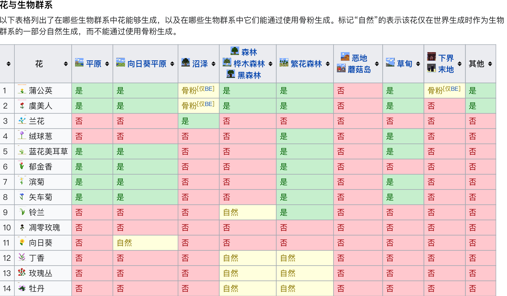

<!-- community/creation/tutorialCollectingDyes -->

# 收集染料

## 前言
染料可以拿来廉价地生产混凝土、陶瓦等各种各样颜色的方块，可以极大提高建筑颜色的多样性。 
（本攻略是关于所有染料的获得方法）

## 花
花是合成各种染料至关重要的原料，所以了解各色花的来源有助于获得各色染料。 
- 花会自然生成与各种生物群系中，在各种生物群系对草方块使用骨粉也会产生各色的花， 
下图展示了各色花会在哪些群系自然生成或者使用骨粉生成： 
 
上图来自[我的世界维基](https://wiki.biligame.com/mc/花)，遵循[CC BY-NC-SA 3.0协议](https://creativecommons.org/licenses/by-nc-sa/3.0/)。
- 直接对 2 格高的花使用骨粉可以直接掉落一份相同的花。
- 在草方块上对一格高的花（凋零玫瑰除外）使用骨粉可以在附近的草方块上生成相同的花。

## 基本染料
能通过在世界自然生成的单个材料制成：
### 红色染料
- 1 玫瑰 或 1 红色郁金香  ---合成--> 1 红色染料。
- 1 玫瑰丛 ---合成--> 2 红色染料。

### 黄色染料
- 1 蒲公英 ---合成--> 1 黄色染料。
- 1 向日葵 ---合成--> 2 黄色染料。

### 绿色染料
- 1 仙人掌 ---烧制--> 1 绿色染料。

### 蓝色染料：
- 1 矢车菊 ---合成--> 1 蓝色染料。
- 1 青金石 ---合成--> 1 蓝色染料。
  - 挖掘获得青金石（最好使用时运三镐）。
  - 与**牧师**村民交易获得。

### 白色染料
- 建造骨粉机
- 杀死骷髅、实体鱼获得骨头合成骨粉。（使用掠夺三剑）
- 在森林、繁华森林，骨粉对着草方块使用可能会生成铃兰。
- 在平原、繁花森林，骨粉对着草方块使用可能会生成白色郁金香。

?> 关于小白塔请查阅[攻略.刷怪笼改造]。()

### 黑色染料
- 1 墨囊 ---合成--> 1 黑色染料。
  - 杀死鱿鱼获得墨囊。（最好使用抢夺三剑）
- 1 凋零玫瑰 ---合成--> 1 黑色染料。

### 棕色染料
- 1 可可豆 ---合成--> 1 棕色染料。

## 准基本染料
能通过世界上生成的单一材料或通过与其他染料合成：
### 橙色染料
- 1 橙色郁金香 ---合成--> 1 橙色染料。
- 1 黄色染料 + 1 红色染料 ---合成--> 2 橙色染料。

### 淡蓝色染料
- 1 兰花 ---合成--> 1 淡蓝色染料。
- 1 蓝色染料 + 1 白色染料 ---合成--> 2 淡蓝色染料。

### 品红色染料
- 1 丁香 ---合成--> 2 品红色染料。
- 1 绒球葱 ---合成--> 1 品红色染料。
- 1 紫色染料 + 1 粉红色染料 ---合成--> 2品红色染料。
- 1 蓝色染料 + 1 红色染料 + 1粉红色染料 ---合成--> 3品红色染料。
- 2 红色染料 + 1 蓝色 + 1 白色染料 ---合成--> 4品红色染料。

### 粉红色染料
- 1 粉色郁金香 ---合成--> 1 粉红色染料。
- 1 牡丹 ---合成--> 2 粉红色染料。
- 1 红色染料 + 1 白色染料 ---合成--> 2 粉红色染料。

### 淡灰色染料
- 1 滨菊 或 1 茜草花 或 1 白色郁金香 ---合成--> 1 淡灰色染料。
- 2 白色染料 + 黑色染料 ---合成--> 3 淡灰色染料。
- 1 白色染料 + 1灰色染料 ---合成--> 2 淡灰色染料。

### 黄绿色染料
- 1 海泡菜 ---烧制--> 1 黄绿色染料。
- 1 绿色 + 1 白色染料 ---合成--> 2 黄绿色染料。

## 二级染料
二级染料通过合成基本染料获得：
- 1 蓝色染料 + 1 红色染料 ---合成--> 2 紫色染料。
- 1 蓝色染料 + 1 绿色染料 ---合成--> 2 青色染料。
- 1 黑色染料 + 1 白色染料 ---合成--> 2 灰色染料。
