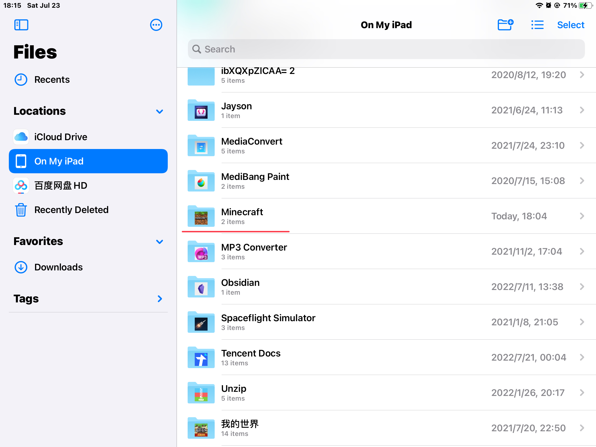

<!-- community/creation/tutorialImportingResourcePacks -->
# 教程.导入资源包

> [!ATTENTION]
> 因为渲染龙引擎的缘故，在 1.18.30 以后资源包形式的光影不再可用。

## 文件格式为 mcpack

<!-- tabs:start -->

#### **iOS 或 Android**

此种文件格式的资源包导入最为简单，找到使用其他应用打开或分享按钮，再选择使用我的世界打开。

#### **Windows**

待编辑...

<!-- tabs:end -->

## 文件格式为 zip

### games 文件夹的路径

在教程开始之前，需要知道 games 文件夹的路径，方便后续操作。

<!-- tabs:start -->

#### **iOS**

iOS 用户可以使用系统自带的**文件**软件直接按照下图找到：

#### **Android**

1.18.0 以上的版本可以按照以下路径找到： 
`Android/data/com.mojang.minecraftpe/files/games` 
而 1.18.0 以下的版本可以直接在目录中找到 games 文件夹。

#### **Windows**

待编辑...

<!-- tabs:end -->

首先解压此文件，或直接预览此压缩包（如果文件管理器允许）。

- 若解压后有文件格式为 mcpack 的文件，那么直接按照[文件格式为 mcpack 的方式](community/creation/tutorialImportingResourcePacks?id=文件格式为-mcpack)导入。

- 若解压得到的文件夹里有 manifest.json 文件， 
  则可以将 manifest.json 文件所在的文件夹移动到`games/com.mojang/resource_packs`文件夹中， 
  或将原压缩包移动至`games/com.mojang/development_resource_packs`文件夹中， 
  再或直接全选 manifest.json 所在文件夹中的所有文件，进行 zip 压缩，并将压缩所得的 zip 文件直接重命名为格式为 mcpack 的文件，再通过[文件格式为 mcpack 的方式](community/creation/tutorialImportingResourcePacks?id=文件格式为-mcpack)导入。
