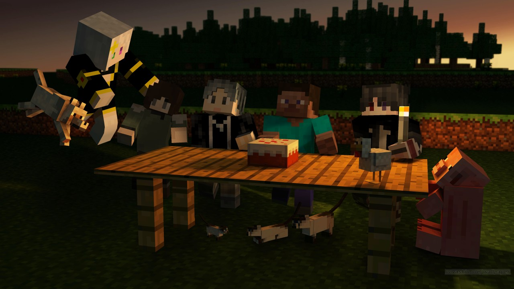
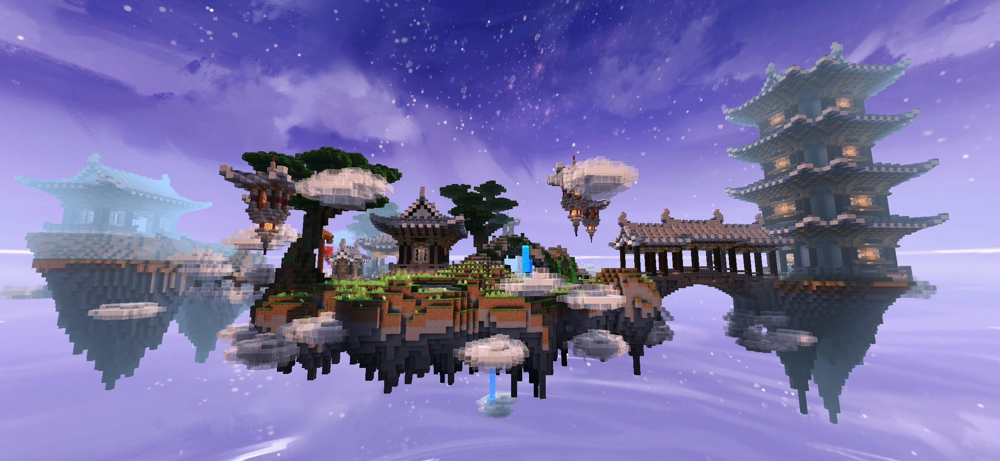

<!-- index -->

# 📜 缘梦长廊

我们正于 Minecraft 国际基岩版中运营着 **<原生 · 自然 · 公益>** 的服务器，本页概括性地介绍了其信息。 
如果您正在寻觅一个值得长久驻足之地，我们期望您通过它了解一下我们，并考虑成为我们中的一员。

---

## 这是个什么样的服务器？

#### # DGOCraft（内服）

是一个旨在通过持续长久的发展与建设，在最纯粹的生存中建设村落、小镇、城邦乃至国度的 **1.16.40** 服务器。

<figure style='width:50%' >
    
    <figcaption style='text-align: center'>————『DGO 基建组』————</figcaption>
</figure>

#### # DGOWorld（外服）

是一个旨在 生存的基础上倾向于玩家探索、互动，为更多的人提供和谐的生存环境且 **随版本更新** 的服务器。

<figure style='width:50%' >
    
    <figcaption style='text-align: center'>————『DGO 外服』————</figcaption>
</figure>

---

## 这个世界的现状？

经过三年的发展积累与沉淀，我们如今可以自豪的表示。DGO——

**『群组服务』** 无论你是萌新还是大佬，喜欢建筑还是红石，亦或者是喜欢聊天唠嗑，这里都非常适合你！ 
**『审查制度』** 我们通过较为严格的审核与邀请制度，确保你能和你一样友善的玩家们一同游戏！ 
**『纯净和谐』** 不划分游戏内玩家权限等级，全服平权。一切都是由您和伙伴们一同建立的！ 
**『自由开放』** 无管理干预发展走向，只要你知晓是非，明确界限，在这可以做任何想做的事情！ 
**『公平公正』** 判断一个玩家是否有错，我们以道德、规章为标准，由管理员主观判断及玩家群体意见而定。 
**『公益非利』** 我们了解增值服务对游戏体验的损害，作为公益服务器，我们不会在游戏内设置任何特权。 
**『稳定长久』** 使用玩家行为记录，每天异地备份地图数据与行为记录，保障玩家数据安全。

#### # 仍处于发展阶段

发展阶段便意味着我们的世界并不完美，在很多方面都尚未得到充分的开发。 
所以我们需要更多的人来加入我们，一起持续长久的建设这个世界。

#### # 曾经的成果展示

<figure style='width:80%' >
    <iframe src="//player.bilibili.com/player.html?aid=540148674&bvid=BV1Mi4y187Gk&cid=174043148&page=1" scrolling="no" border="0" frameborder="no" framespacing="0" allowfullscreen="true"> </iframe>
    <figcaption style='text-align: center'><a href='https://b23.tv/4Nu8dPN'>——『2020 年成果展示』——</a></figcaption>
</figure>

<figure style='width:80%' >
    <iframe src="//player.bilibili.com/player.html?aid=504223289&bvid=BV1Zg411T7qv&cid=369169295&page=1" scrolling="no" border="0" frameborder="no" framespacing="0" allowfullscreen="true"> </iframe>
    <figcaption style='text-align: center'><a href='https://b23.tv/ApapYS9'>——『2021 年成果展示』——</a></figcaption>
</figure>

---

## 如何加入我们？

我们的入服流程相对复杂，需要您加入我们的交流群并查阅 [DGOWiki](https://wiki.dgo.world) 的入服须知，您需要有一定的耐心才能完成。

---

感谢您阅读至此。 
相遇即是缘分，欢迎来到 DGO 缘梦长廊。
